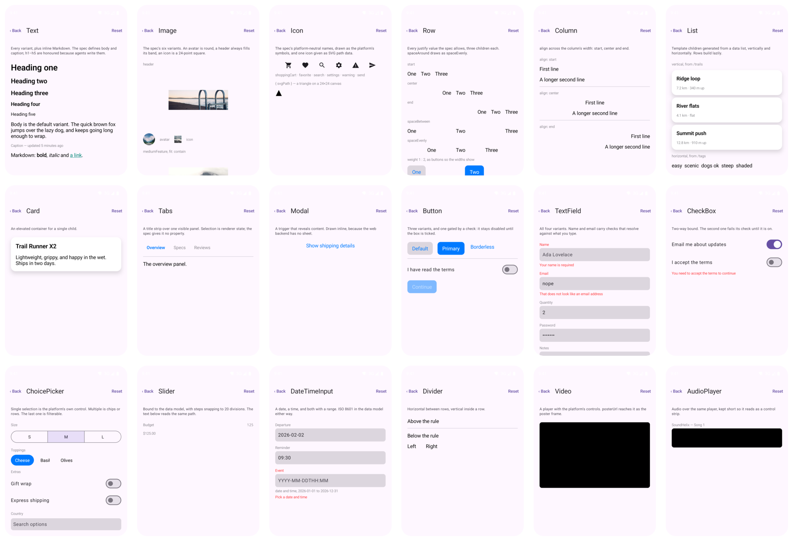
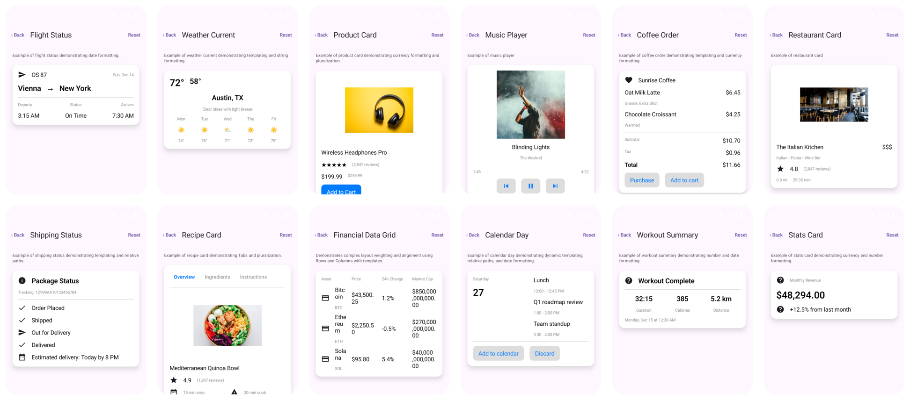

# The basic catalog, natively

One screen per component in the A2UI v1.0 basic catalog, and one per example surface the
A2UI project ships: the 43 v1.0 examples and the 43 v0.9 ones every upstream gallery still
shows. Each is described as A2UI and drawn by the BindJS catalog on Compose. It exists to
look at the catalog: pick a component and see what an agent gets when it names it. The
screens and messages are the [iOS catalog example](../../ios/catalog/README.md)'s, one for
one.



Install it, run every surface headlessly, or open one screen directly:

```bash
./gradlew -p ../../../android :catalog:installDebug                  # onto a device or emulator
./gradlew -p ../../../android :catalog:connectedDebugAndroidTest     # every surface, headless
adb shell am start -n ai.metabind.a2ui.catalog/.MainActivity --es show spec09-03_calendar-day
```

The last line opens a screen directly, which is what a screenshot script wants. Ids are
`text`, `image`, and so on for the basic screens, and `spec-<file>` and `spec09-<file>` for
the examples.

## What each screen shows

`Showcase.kt` holds the basic-catalog surfaces. Each is a real `createSurface` message,
with a data model where a component binds to one, so what you see comes through the engine
the same way an agent's surface would: bindings resolve, `checks` run, actions dispatch.
Tapping a button logs the action the agent would have received.

## The spec examples

The build copies `vendor/spec/v1_0` and `vendor/spec/v0_9` examples into the APK as assets,
so the app needs nothing outside its module and no generated code. The iOS example has to
embed the same files as generated Swift because SwiftPM has no build-time asset copy. The
two corpora have the same names; the v1.0 rewrite dropped the heading variants, so where a
v0.9 screen looks bolder than its v1.0 twin, the file differs, not the catalog.



## One host, one store per screen

Each screen resets the host and applies its own message stream. That gives every example a
clean store, which the iOS app achieves with a host per example, and it sidesteps the fact
that the v0.9 and v1.0 files use the same surface ids.

## After changing a catalog component

Regenerate the committed renderer bundle:

```bash
pnpm sync:native:android
```

Then run the app again. `CatalogSurfacesTest` is the quick way to tell a broken bundle from
a broken layout: it applies all 104 surfaces and reports any that fail to decode or produce
a diagnostic. It is an instrumented test, so it needs a device or emulator; CI builds the
app but cannot run it.
