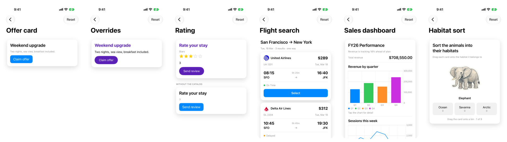

# Your own components, in an agent's surface

Six screens behind an index, in two sections, split by what the *agent* named rather than
by what the app supplied. **Built-in catalog** is types the bundled catalog already has:
the offer card as it ships, and again with `Text` and `Button` replaced. **Custom
components** is types it does not have at all — a `Rating`, a `FlightCard`, a `Chart` and a
`SortBoard`, all written by this app and named by the agent as if they had always been
there.



```sh
open A2UICustomCatalog.xcodeproj    # iOS — pick a simulator and run
swift run                           # macOS — same sources, a window
swift run A2UICustomCatalog --check # the bridge, headless
```

## Offer card, and Overrides

The A2UI messages are byte-for-byte `examples/web/custom-catalog`'s, and both screens draw
the same one. *Offer card* renders it on a host with the basic catalog; *Overrides* renders
it on a host handed three BindJS sources and three catalog entries:

```swift
host.useCatalog(
    sources: ["BrandText": brandText, "BrandButton": brandButton, "Rating": rating],
    catalog: ["Text": "BrandText", "Button": "BrandButton", "Rating": "Rating"]
)
```

`sources` is BindJS component name → source. `catalog` is A2UI type → BindJS component
name, merged over the basic catalog, so only what changes is named: two overrides
(`Text`, `Button`) and one addition (`Rating`). Everything else still comes from the
bundled catalog.

## Rating

A type the basic catalog has no entry for. The host that was given it draws five tappable
stars — a tap writes the number into the data model, and the caption bound to the same
path repaints from it. The host that was not reports `Rating` as unknown, which is what
the second panel shows.

## Flight search

A `Column` templated over three rows of the data model, each drawn by `FlightCard` — one
A2UI type standing in for a whole row of chrome. The agent binds eleven properties and an
action whose context is resolved per row, so the third card's tap arrives carrying
`AA 184`; it never learns that a tap also flies a paper plane across the card.

The plane is BindJS `useState` and timers, entirely inside the component. Neither the
agent nor the host has to know: a tap dispatches the A2UI action, and the animation is the
component's own business.

`List` would be the other way to write those rows, and is worth avoiding here: it is a
`ScrollView`, and a surface that scrolls itself clips its content when the host puts it
inside a scrolling screen. `Column` leaves the scrolling to the host.

## Sales dashboard

One A2UI type over three chart shapes. `Chart` takes `data` — an array of
`{ label, value }` — a variant and a title, and the surface names it three times: a bar
chart over four quarters, a line over seven days, a donut over four sources. Which marks
that becomes, and how a selection is reported, is the component's; the agent describes only
the numbers.

The total above them goes the other way. `formatCurrency` is an A2UI standard function, so
the engine formats it before the surface is built — the chart formats its own readout
itself, because that is drawn inside a component the engine cannot reach into.

Two platform notes, both discovered rather than assumed:

- **`.opacity()` on a chart mark is ignored by every renderer.** Dimming the unselected
  marks is the obvious next move and no backend honours it — each logs "unsupported chart
  mark modifier" and draws them at full strength. The selection is shown with a rule, an
  enlarged point and a caption instead.
- **Selection itself does not arrive on Android.** `chartXSelection` and `chartSelection`
  cross into the AST and the charts draw, but no drag or tap on the Compose chart calls
  back, so the readout stays on its hint. It works where the renderer delivers it; this is
  bindjs-android's to close, not this example's.

## Habitat sort

`SortBoard` is one A2UI type standing in for a whole interaction: nine animals dealt in a
shuffled deck, one face-up at a time, dragged onto one of three habitats. A drop is scored
against the answer key travelling on each card, and the deck ends on a score.

None of that reaches the data model, deliberately. Which card is face-up, where the finger
is, what the last verdict was — A2UI has nowhere to put any of it, and it should not: it is
affordance state. The agent supplies the cards, the bins and the key, and gets back
whatever action the surface declared.

The drop model is arithmetic rather than hit-testing. The card is centred over the board,
so its finishing x is `boardWidth / 2 + translation.x`, and which column that lands in is
the bin; `boardWidth` is a prop because only the agent knows how wide the surface is drawn.
A release that was not pulled `DROP_DEPTH` down does not count, which is what makes a stray
movement snap back instead of sorting.


## The files

`Brand.swift` holds the overrides and `Rating`; `Flights.swift`, `Dashboard.swift` and
`Habitat.swift` each hold one component and the surface that names it; `Agent.swift` has
the offer and review messages, `Demo.swift` the five hosts, and `Checks.swift` proves all
of it without a window. `ContentView.swift` is the
index and the chrome — no part of it describes an offer, a star, a flight or a chart.

The plane needs a run loop, so `--check` proves the card builds and the tap dispatches;
seeing it fly means running the app.

## Writing one

Props arrive under their A2UI names, plus the two things only the engine can supply: an
`action` callback on nodes with an A2UI action, and `set<Prop>` for every prop bound to a
data-model path (`value` → `setValue`). Stick to components and modifiers BindJS has on
both platforms and the same source restyles the web app too — and to the colour names it
knows, since an unknown one produces no colour rather than an error.
