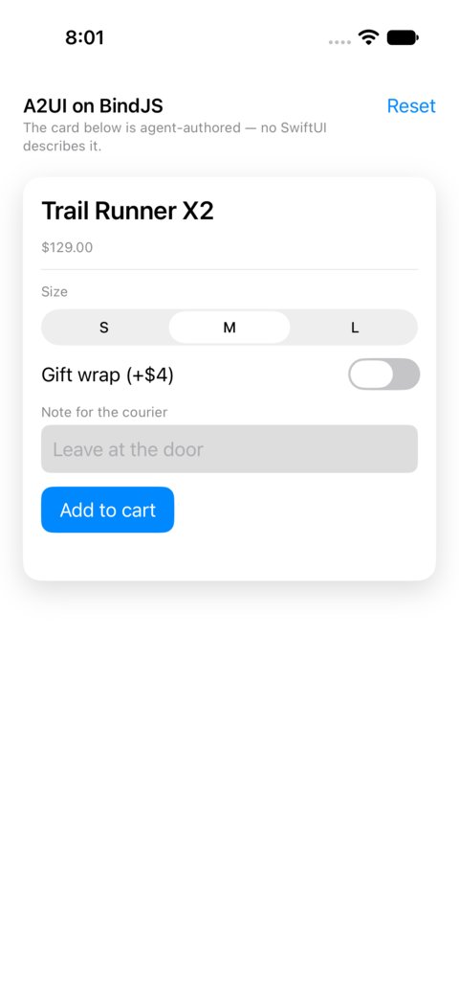

# A2UI on iOS and macOS

A SwiftUI app whose only screen is written by an agent.

`Agent.swift` holds the A2UI, the same JSON the browser examples receive. There is no
SwiftUI anywhere in this target describing the product card: it names components, binds
them to a data model, and the catalog decides what that looks like on this platform.



Run it on a simulator, as a macOS window, or headlessly:

```bash
open A2UIMinimal.xcodeproj      # iOS: pick a simulator and run
swift run                       # macOS: same sources, a window
swift run A2UIMinimal --check   # the same bridge, headless
```

The `.xcodeproj` is checked in so it opens and runs with no tooling. `project.yml` is what
it is generated from; run `xcodegen` after changing it.

Regenerate the renderer bundle after changing the library:

```bash
pnpm sync:native
```

## Layout

Paths are relative to the repository root:

```text
ios/packages/a2ui-bindjs-apple             the library: A2UIHost, A2UISurfaceView, the renderer
examples/ios/minimal/Sources/A2UIMinimal   the app: chrome, the agent's messages, a smoke test
```

The app is the thin part. `Agent.swift` holds the A2UI, `Demo.swift` decides what an action
means, and `ContentView.swift` is the chrome around one `A2UISurfaceView`.

## How it fits together

```text
BindJSContext                     one JSContext, one BindJSRuntime
  ├── BindJSRuntime.js            shipped by bindjs-apple
  ├── a2ui-native.js              shipped by the A2UI package; attaches to that runtime
  │     host.apply(messages)      agent messages in
  │     host.ast(for: "main")  ►  AST
  └── view(id:buildingAST:)    ►  SwiftUI
```

One runtime shared with the host, and redraws that come from the store rather than the
runtime, are what any host has to get right, and the
[`a2ui-bindjs-apple` README](../../../ios/packages/a2ui-bindjs-apple/README.md#the-two-things-a-host-has-to-get-right)
explains both.

**Actions are pushed, not polled.** A tap happens inside JavaScript with no Swift frame
below it, so the bridge queues the action and calls `a2ui.onActions` back through a global
the host installed. A tap need not change the data model, so waiting for a redraw to
notice one would miss it.

**Diagnostics are collected outside the view pass.** `A2UIHost.apply` renders each surface
once to harvest them, which keeps `@Published` writes out of SwiftUI updates and costs
nothing: the render session memoizes, so the next redraw skips the work anyway.

## Known native differences

`Slider` has no native BindJS view, so `A2UISlider` renders on the web only. The demo
surface avoids it.

On **macOS** the multiple-selection chips pick up the platform's default button chrome,
because BindJS has no `buttonStyle` modifier to turn it off. iOS and the web draw them as
the bare pills the catalog describes. Single selection is unaffected: it is a `Picker`,
so it arrives as a real segmented control.

## Packaging

`ios/packages/a2ui-bindjs-apple` has no manifest of its own: SwiftPM cannot address a
package in a subdirectory by URL, so the repository's root `Package.swift` declares the
library and points its target at those sources. This example depends on that root by path,
and the library depends on `bindjs-apple` by version.
