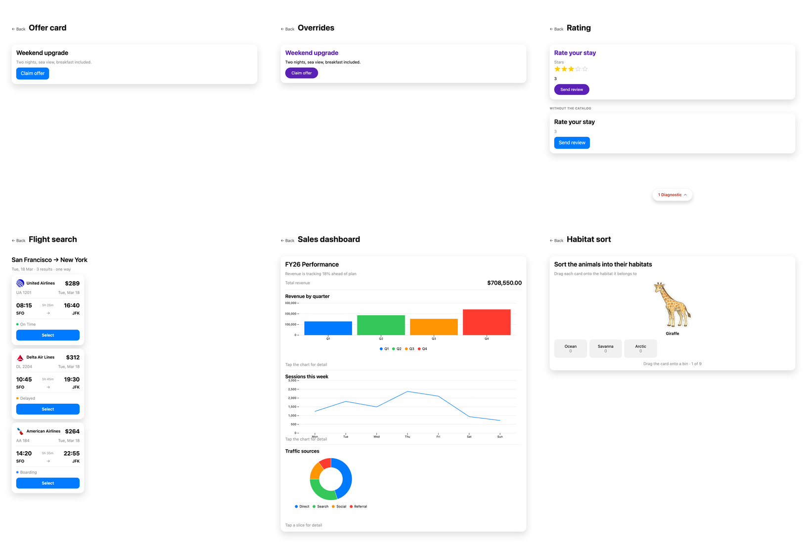

# Your own components, in an agent's surface

Six screens behind an index, in two sections, split by what the *agent* named rather than
by what the app supplied. **Built-in catalog** is types the bundled catalog already has:
the offer card as it ships, and again with `Text` and `Button` replaced. **Custom
components** is types it does not have at all: a `Rating`, a `FlightCard`, a `Chart` and a
`SortBoard`, all written by this app and named by the agent as if they had always been
there.

```sh
pnpm dev:custom-catalog      # :5183
```



A catalog is a map from A2UI component type to the name of a registered BindJS component,
so overriding one means supplying the component and changing one entry. There is no
runtime to build: `sources` and `catalog` on `<A2UIRenderer />` are enough, and the
renderer registers them on the runtime it already owns.

The BindJS sources and the A2UI messages are byte-for-byte the ones
`examples/ios/custom-catalog` and `examples/android/custom-catalog` use, which is the
point: one component, drawn by React here and by SwiftUI and Jetpack Compose there. Those
two READMEs describe each screen in detail.
