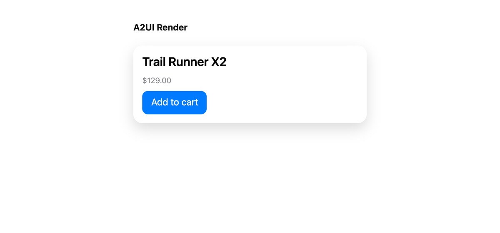

# A2UI on the web, minimal

The smallest useful A2UI app. An agent sends messages, `useA2UIStore` keeps them, and
`<A2UIRenderer />` draws whatever the store holds. There is no BindJS runtime to construct,
no catalog to register and no surface to name; `App.tsx` is the whole thing.

```sh
pnpm dev:minimal      # :5182
```



Press **Add to cart**. The action leaves with its context resolved against the data model,
and the app answers it the way an agent would, with an `updateDataModel` applied to the
same store. The button's label repaints from the model; the app never touches the view.
