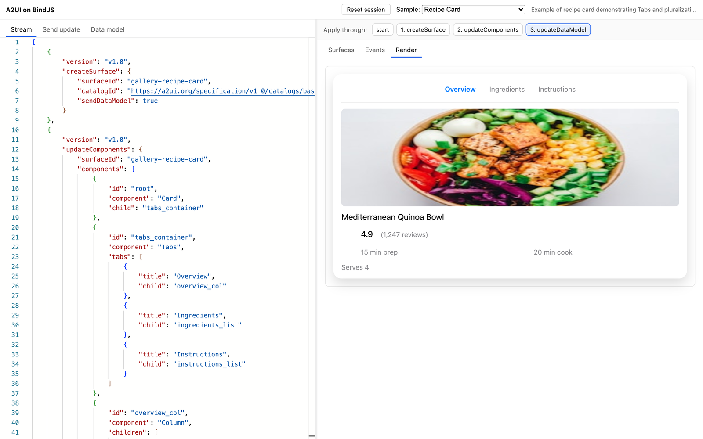

# Playground

A Monaco editor for an A2UI message stream, a timeline to scrub it, and every view of the
result: the parsed events, the surfaces in the store, and the rendered output. It exists to
answer "what does the renderer do with this?" without writing an app.



Start it from the repository root:

```bash
pnpm dev:playground                                     # builds core and react, then serves on :5181
pnpm dev                                                # the same
pnpm --filter @metabindai/a2ui-bindjs-playground test   # mounts the real App in jsdom
```

The playground reads `core/dist` and `react/dist`, so run `pnpm build` after changing
either library. The test is worth running for the same reason it exists: a dev-server-only
failure (a CommonJS dependency served raw after it was excluded from Vite's dep optimizer)
once blanked the page while `build` and every package test stayed green.

## What it shows

The top bar has a sample picker in two groups, **Playground** (hand-written probes: a
profile card, a templated employee list, and more) and **A2UI spec examples** (the 43
official v1.0 examples, read straight from `vendor/spec/v1_0/catalogs/basic/examples`), plus
**Reset session**, which rebuilds the surface from the authored stream and discards
anything sent since.

The left pane is input, in three modes:

- **Stream** is the authored message stream, a JSON array of envelopes. Editing it replays
  the whole stream from scratch, which is the right model for composing a document.
- **Send update** composes one message and applies it to the live session without a replay,
  which is what an agent does: one long-lived surface, incremental messages pushed into it.
  Anything typed into a rendered input survives.
- **Data model** edits the live surface's data model directly. Applying it sends an
  `updateDataModel` at the root.

The right pane starts with the timeline, **Apply through:** followed by one chip per
message (`start`, `1. createSurface`, and so on; a rejected message is marked). Pick a chip
and every tab shows the store as it stood after that message. Under it, three tabs:

- **Surfaces**: one card per surface in the store, with its id, version, `sendDataModel`,
  and catalog id; the data model as JSON; and the components either **raw**, as the agent
  sent them, or **resolved**, with every `{ path }` binding read and `{ call }` function
  invoked, plus anything that failed to resolve.
- **Events**: one card per envelope, with its type, surface, and whether it was applied,
  rejected, or is still pending at the selected step. A rejected message shows the
  `A2UIProtocolError`'s code, JSON Pointer path, and message above the raw JSON. Sent
  updates are listed after the stream.
- **Render**: every surface the stream created, each on its own `<A2UIRenderer>` over the
  one shared store and labeled when there is more than one. Diagnostics the renderer could
  not draw are listed under each surface, and the last five actions dispatched are printed
  as JSON.

The default sample is a profile card that creates a surface, changes the name, swaps the
`Text` for a `formatString` call, and deletes the contact block. By the last step the Render
tab shows `Hello, Jane Doe`, which proves bindings and functions in one line.

## How it fits together

```text
source (JSON text)
  ├── replay()            ►  fresh SurfaceStore per edit; a ReplayStep after every message
  │     └── snapshotSurface()  ►  components raw and resolved, for the Surfaces tab
  └── useLiveStore()      ►  the session store: seeded from the stream up to the selected
        │                     step, then mutated in place by Send update and Data model
        └── <RenderView>  ►  one <A2UIRenderer> per surface id
```

`src/lib/replay.ts` runs `parseMessage` and `messageType` on each envelope and applies it,
recording the error if it throws and the surfaces afterward either way.
`src/lib/snapshot.ts` resolves each component's props with the standard function registry.
`src/lib/useLiveStore.ts` keeps the live store; `send` applies one message and bumps a tick,
`reset` bumps an epoch that also remounts the renderer, so component-local state (an open
`Modal`, a selected tab) is cleared too. `src/monaco-setup.ts` loads Monaco from the local
package with its JSON worker, so the editor validates and formats without a CDN.

## What to read next

- [`examples/web/minimal`](../minimal/README.md) is the same store and renderer in the
  fewest lines.
- The [message table](../../../README.md#messages) in the README lists what each envelope
  the timeline shows does, and where it is supported.
